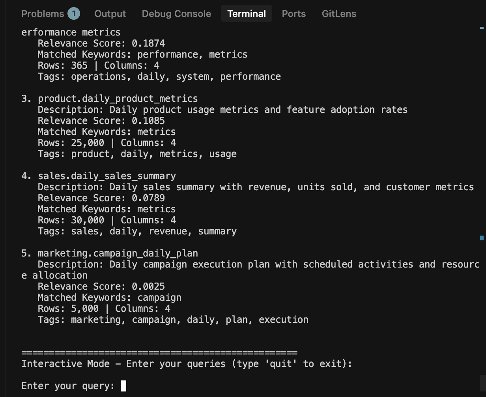
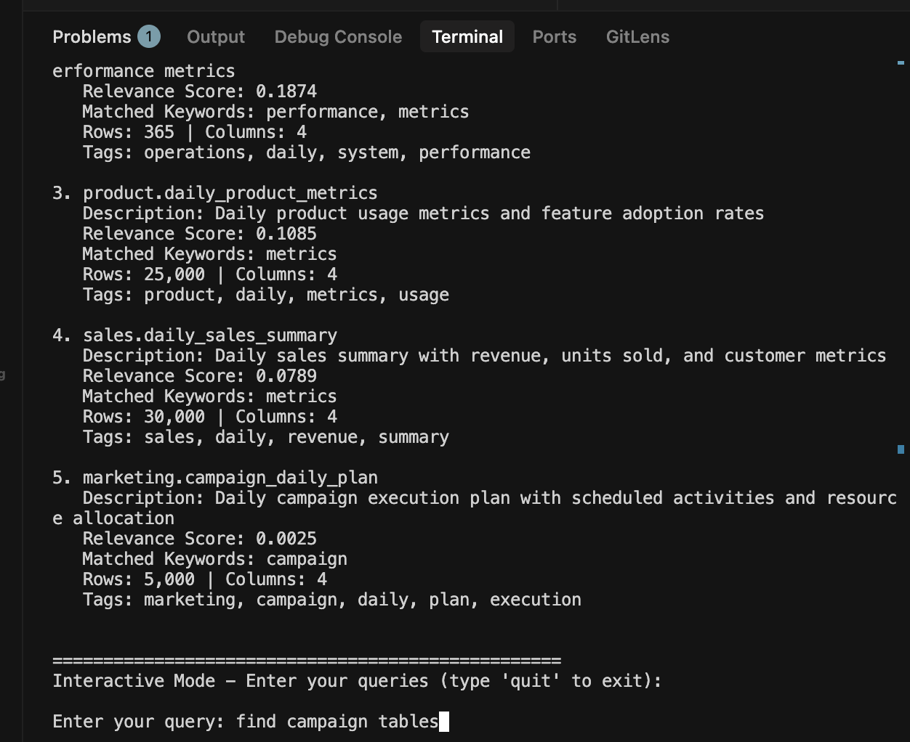
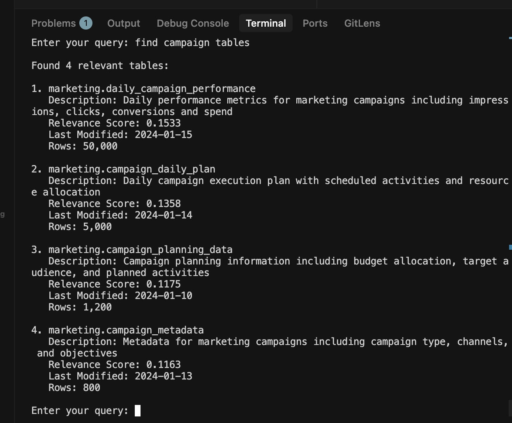

This is the README for question number 1

### How to run
1. Since we are using test based runner, we encourage you to set up VS code launch.json

```
{
    // Use IntelliSense to learn about possible attributes.
    // Hover to view descriptions of existing attributes.
    // For more information, visit: https://go.microsoft.com/fwlink/?linkid=830387
    "version": "0.2.0",
    "configurations": [

        {
            "name": "Python: Test search table",
            "type": "python",
            "request": "launch",
            "program": "${workspaceFolder}/1_Table_search/pkg/big_query/services/table_search_test.py",
            "console": "integratedTerminal",
            "cwd": "${workspaceFolder}/1_Tablse_search",
            "env": {
                "PYTHONPATH": "${workspaceFolder}/1_Table_search",
                "PROJECT_MAIN_DIR": "${workspaceFolder}"
            },
            "args": [
                "--url", "",
            ]
        }
    ]
}
```

2. Now run for "Python: Test search table"

3. The result 


Give query


Query result 

