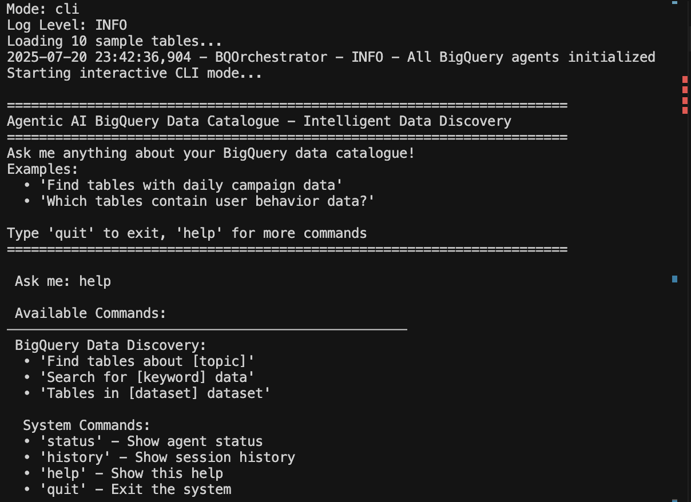
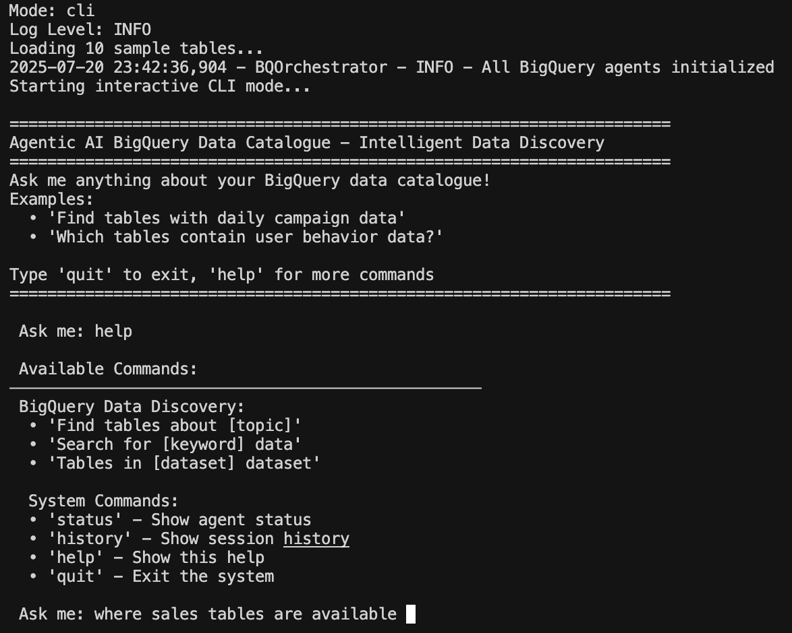
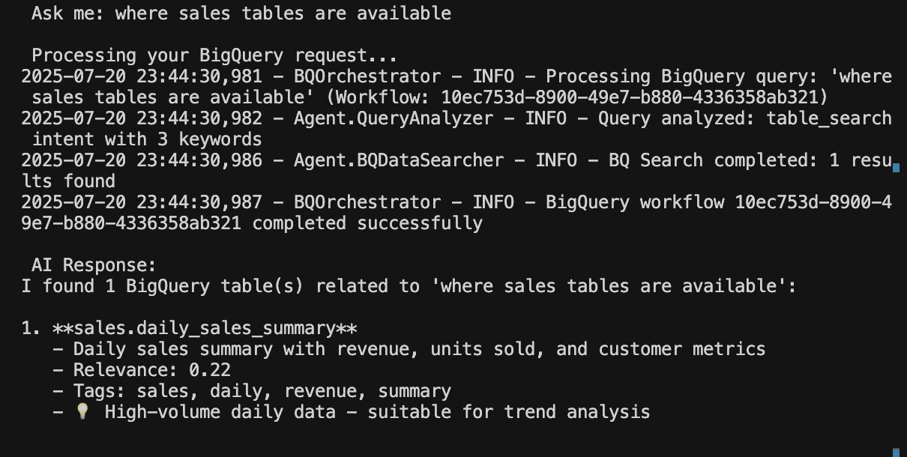
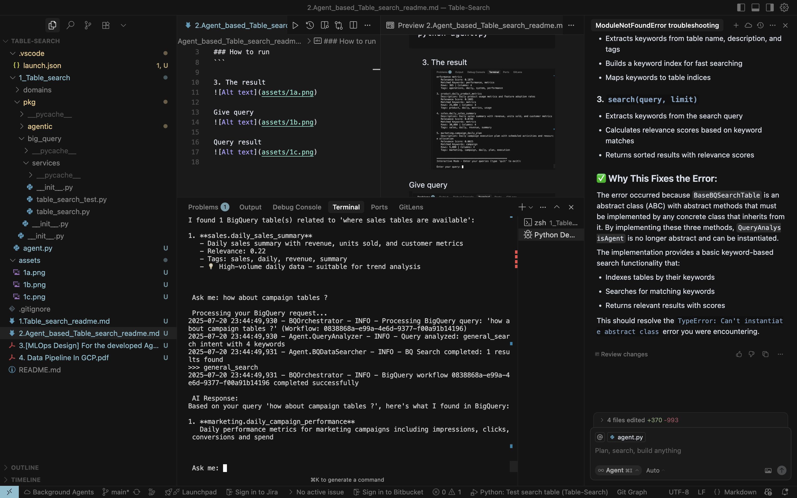
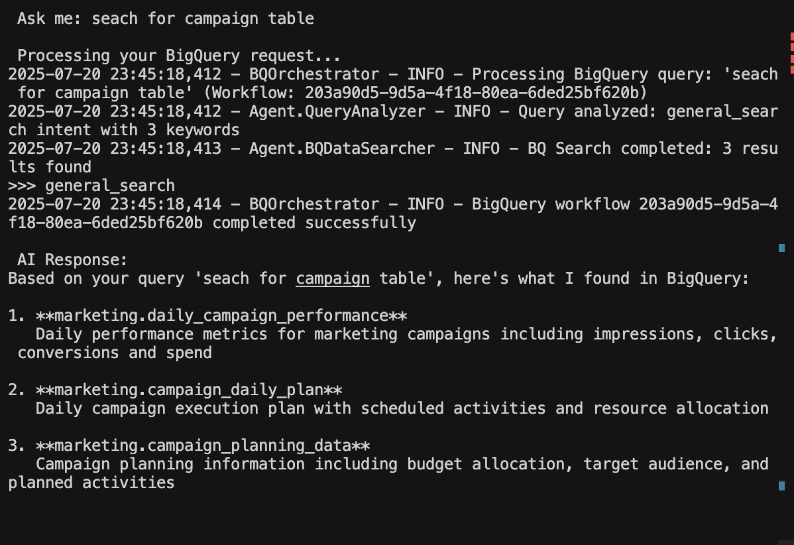

This is the README for question number 2

### Algorithm 
1. TF IDF
2. Word Matching

so literallly this agent employe tho most basic NLP algorithms. No model training required 

### Agent list
1. Interface agent: handle user input, help and quit requests are directly handle here
2. Orchestrator agent
3. Query analyze agetnt: to analyze query intent type
4. table search agent: to search and rank tables, based on TF IDF and word matching
5. Generate response agent: to generate response according to intent types formatting styles

### Agent Flow
interface agent >> orchestrator agent >> Query analyze agent >> table search agent >> response agent >> (back to) orchestrator agent >> back to interface agent 

### Intent Types enum
1. Table search
2. table schema

```
search campaign tables 
vs 
show campaign schema 

will end up into different response format due to differen intent type
```

### How to run
Go inside `1_Table_search` folder,
inside the folfer, then run 
```
python agent.py
```

### How to get CLI help
```
Ask me: help
```

### How to Quit 
```
Ask me: exit
```

### How to get chat history
```
Ask me: history
```

### How to get specific table
```
Ask me: search for campaign tables 
```

### How to get specific table with schema info
```
Ask me: get schema for campaign tables 
```


3. The results










